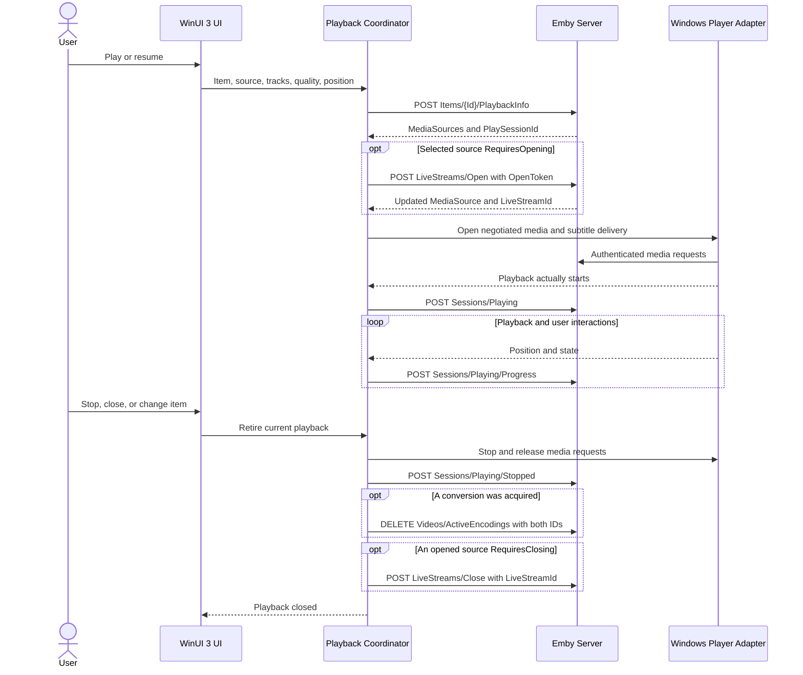

# Playback, Streams, and Sessions

Research date: 2026-09-09. Scope: an independent Windows client for Emby Server, with a native WinUI 3 interface. The original research describes the server contract and a proposed client workflow. Later implementation findings are explicitly identified below; they do not certify every server version or playback engine.

## Contract and terminology

The primary machine-readable reference for this document is the official [Emby SDK OpenAPI snapshot at commit `bdd0dd7c0801f6e069dff2795d80cddae6f91791`](https://raw.githubusercontent.com/MediaBrowser/Emby.SDK/bdd0dd7c0801f6e069dff2795d80cddae6f91791/Documentation/Download/openapi_v2_noversion.json). The snapshot omits the server version. The separately hosted [static OpenAPI document](https://swagger.emby.media/openapi.json) identifies itself as `4.1.1.0` and differs from the SDK snapshot. Neither establishes the version or complete behavior of the eventual user's server. Consult that server's API browser when establishing the supported compatibility matrix.

Paths below are relative to the configured Emby API base, normally `https://server.example/emby`. Preserve any reverse proxy path prefix. Use user authentication and the same stable `DeviceId` used when signing in. JSON examples contain placeholders and illustrate request structure, not captured server responses. Never log access tokens, token-bearing media URLs, or subtitle URLs. A media URL may require authentication even when an old schema labels the operation as unauthenticated. [REST API access](https://dev.emby.media/doc/restapi/index.html)

Emby's published [Playback Guidelines](https://dev.emby.media/doc/restapi/Playback-Guidelines.html) use these specific definitions:

| Published term | Published meaning | Client handling |
| --- | --- | --- |
| Direct Play | Read the source through `MediaSourceInfo.Path`, bypassing the server's media delivery. | A later, explicit file/share playback feature. A server filesystem path is not automatically accessible from the Windows client. |
| Direct Stream | Stream the original file through the server, without encoding or remuxing. | Preferred MVP path when the engine accepts the original container, codecs, selected streams, and bitrate. |
| Transcode | Request server-side conversion to a format the client accepts. | Fallback for codec, container, bitrate, or subtitle incompatibility. A negotiated conversion can copy compatible streams instead of encoding them. |

Other players and newer server dashboards may use these labels differently, especially for remuxing. Keep internal facts separate: transport, container conversion, video copy/encode, audio copy/encode, and subtitle delivery. Map the reported `PlayMethod` to the target Emby contract; do not infer it solely from `.m3u8`, file extension, or a Jellyfin example. A server-generated HLS URL is not proof that the video is being re-encoded.

All `*Ticks` positions and durations use 100-nanosecond units: `10,000` ticks per millisecond and `10,000,000` per second. Use `Int64` / `TimeSpan.Ticks` in C#. The current SDK stream parameter description states the correct conversion; the old static schema contains a reversed description for some fields. Bitrate limits are bits per second; `Size` is bytes. Keep absent duration or bitrate distinct from zero.

## Endpoint inventory

`MVP` means required for on-demand video playback. `Conditional` means required whenever a negotiated source uses that mechanism, even if Live TV browsing itself is deferred. `Later` means optional product scope.

| Scope | Method and relative path | Input | Successful result / responsibility |
| --- | --- | --- | --- |
| MVP | `POST /Items/{Id}/PlaybackInfo` | Item ID in path; JSON `PlaybackInfoRequest`. | `PlaybackInfoResponse`: candidate sources, `PlaySessionId`, possible `ErrorCode`. Use this method for capability-aware negotiation. |
| Optional inspection | `GET /Items/{Id}/PlaybackInfo?UserId={UserId}` | Item and user IDs. | `PlaybackInfoResponse`; this GET schema does not accept a JSON device profile. It is not an equivalent replacement for POST negotiation. |
| MVP | `GET /Videos/{Id}/stream` or `GET /Videos/{Id}/stream.{Container}` | Prefer returned `DirectStreamUrl`; fallback construction must carry the chosen source and playback session. `Static=true` requests original bytes. | Media bytes. Use original extension for static streaming; output extension for conversion. |
| MVP fallback | `GET /Videos/{Id}/master.m3u8` | Prefer the complete returned `TranscodingUrl`. | HLS manifest; let the media engine follow its variants and segments. |
| MVP | `GET /Videos/{Id}/{MediaSourceId}/Subtitles/{Index}/Stream.{Format}` | Path IDs, actual stream index, format; optional `StartPositionTicks`, `EndPositionTicks`, `CopyTimestamps`. | Subtitle content, usually requested as `vtt` or `srt` according to engine support. |
| Conditional | `POST /LiveStreams/Open` | JSON `LiveStreamRequest`, including selected `OpenToken` and playback context. | `LiveStreamResponse.MediaSource`; replace the pre-open source with this authoritative result. |
| Conditional | `POST /LiveStreams/Close?LiveStreamId={LiveStreamId}` | The live stream ID owned by this playback. | Release the opened media source. |
| MVP | `POST /Sessions/Playing` | JSON `PlaybackStartInfo`. | Report actual playback start. |
| MVP | `POST /Sessions/Playing/Progress` | JSON `PlaybackProgressInfo`. | Synchronize progress and player state. |
| MVP | `POST /Sessions/Playing/Stopped` | JSON `PlaybackStopInfo`. | Finish reporting this playback, including its last known position. |
| MVP for conversion | `DELETE /Videos/ActiveEncodings?DeviceId={DeviceId}&PlaySessionId={PlaySessionId}` | Both query parameters. | Stop this playback's conversion processes. Do not perform device-wide cleanup with a missing playback ID. |
| Compatibility option | `POST /Videos/ActiveEncodings/Delete?DeviceId={DeviceId}&PlaySessionId={PlaySessionId}` | Same identifiers. | Documented alternate method; enable only when needed and supported. |
| Later | `POST /Sessions/Playing/Ping?PlaySessionId={PlaySessionId}` | Playback ID. | Playback-session ping. Its existence does not replace start/progress/stop reporting or establish a heartbeat interval. |
| Session integration | `POST /Sessions/Capabilities/Full?Id={SessionId}` | JSON `ClientCapabilities`. | Register playable media and implemented commands; optional device profile. |
| Legacy alternative | `POST /Sessions/Capabilities?Id={SessionId}` | Query parameters for playable media, commands, and support flags. | Reduced capability registration; prefer the full JSON endpoint. |
| Later audio | `GET /Audio/{Id}/stream`, `GET /Audio/{Id}/stream.{Container}`, `GET /Audio/{Id}/master.m3u8` | Audio-specific negotiated stream settings. | Audio stream or HLS; reuse playback lifecycle and reporting. |
| Later audio | `GET /Audio/{Id}/universal` | Item ID; documented parameters include `DeviceId` and `StartTimeTicks`. | Alternative audio delivery endpoint. Keep out of the MVP video implementation. |

The SDK also documents `/Items/.../Subtitles/...` aliases, path-based subtitle start offsets, and `HEAD` subtitle operations. The client does not need every alias. `POST /LiveStreams/MediaInfo` exists, but its published summary says “Closes a media source” and its response is unspecified; defer its use until the target server contract is clarified.

Sources: [MediaInfoService](https://dev.emby.media/reference/RestAPI/MediaInfoService.html), [PlaystateService](https://dev.emby.media/reference/RestAPI/PlaystateService.html), [SubtitleService](https://dev.emby.media/reference/RestAPI/SubtitleService.html), [DynamicHlsService](https://dev.emby.media/reference/RestAPI/DynamicHlsService.html), [HlsSegmentService](https://dev.emby.media/reference/RestAPI/HlsSegmentService.html), [SessionsService](https://dev.emby.media/reference/RestAPI/SessionsService.html), and the pinned SDK schema above.

## Playback negotiation

### `PlaybackInfoRequest`

Send a fresh negotiation request when the user starts playback or when the existing delivery can no longer satisfy the selected source, track, subtitle method, or quality. Treat the server result as time-sensitive rather than a library metadata cache entry.

| Field | Type | Use |
| --- | --- | --- |
| `Id` | string | Item ID; keep consistent with the path if included in the JSON. |
| `UserId` | string | Current authenticated user's ID. |
| `MediaSourceId` | string | Selected edition/version. Omit during initial candidate selection when the user has not selected one. |
| `MaxStreamingBitrate` | int64 | Effective user/network bitrate budget in bits per second. |
| `StartTimeTicks` | int64 | Requested absolute position in the chosen source. |
| `AudioStreamIndex` | int32 | Selected Emby stream index, not the UI list position. |
| `SubtitleStreamIndex` | int32 | Selected Emby stream index; `-1` represents subtitles off in the documented command model and must be confirmed for negotiation on supported servers. Omission allows server defaults. |
| `MaxAudioChannels` | int32 | Actual output/engine channel limit. This is an integer here, unlike the string field in `TranscodingProfile`. |
| `DeviceProfile` | object | Measured capabilities of the selected playback engine. |
| `EnableDirectPlay` | bool | Whether direct source access is allowed for this request. Default the HTTP-only MVP policy to false. |
| `EnableDirectStream` | bool | Whether original media delivery is allowed. |
| `EnableTranscoding` | bool | Whether server conversion is allowed by client policy. The server can still reject it for user policy or resource constraints. |
| `AllowVideoStreamCopy`, `AllowAudioStreamCopy` | bool | Allow compatible video/audio to be copied during a conversion. |
| `AllowInterlacedVideoStreamCopy` | bool | Allow copy only if the selected engine can display/deinterlace that input correctly. Present in the pinned SDK snapshot. |
| `IsPlayback` | bool | Distinguish actual playback negotiation from informational use. Confirm the side effects and defaults on supported servers. |
| `AutoOpenLiveStream` | bool | Request automatic opening where supported. The client must still track and release returned resources. |
| `LiveStreamId` | string | Existing opened stream, when continuing an owned source. |
| `CurrentPlaySessionId` | string | Existing playback context during renegotiation. Present in the pinned SDK snapshot; its precise reuse behavior requires target-server confirmation. |

The old static schema exposes `DirectPlayProtocols`; the pinned SDK request does not. Do not make that older field mandatory in the application DTO. Send optional fields according to the supported server contract and accept unknown response properties without failing deserialization.

### `PlaybackInfoResponse` and media-source selection

`MediaSources` is an array, `PlaySessionId` is an opaque string, and `ErrorCode` can be `NotAllowed`, `NoCompatibleStream`, or `RateLimitExceeded`. Handle a successful HTTP response containing an error or no playable sources as a failed negotiation. A permissions error must not trigger retries with more permissive capabilities. A no-compatible-stream error should offer a supported quality/track choice or a clear unsupported-media message.

Keep these identifiers separate:

| Identifier | Lifetime / meaning |
| --- | --- |
| `DeviceId` | Stable installation identity shared by authentication, streaming, reporting context, and encoding cleanup. |
| `SessionId` | Server client/login session, also used for remote-control addressing and capability registration. |
| `PlaySessionId` | Negotiated playback context. Use the returned value in stream requests, reports, and cleanup. |
| `MediaSourceId` | The particular file/version chosen for an item. |
| `LiveStreamId` | A server resource handle for an opened source; preserve it until close. |

Select a source the chosen engine can consume within the effective bitrate and user policy. Present `MediaSourceInfo.Name` when the user must choose an edition. Source duration can differ between editions: use `MediaSourceInfo.RunTimeTicks`, not the containing item's runtime, for that playback. Prefer server-suggested audio/subtitle defaults unless the user explicitly overrides them. [Playback Guidelines](https://dev.emby.media/doc/restapi/Playback-Guidelines.html)

| `MediaSourceInfo` fields | Client responsibility |
| --- | --- |
| `Id`, `Name`, `Container`, `Bitrate`, `Size`, `RunTimeTicks` | Version selection, diagnostics, transport suitability, duration. |
| `Protocol`, `Path`, `IsRemote`, `HasMixedProtocols` | Describe the source. A filesystem path is server metadata until direct access has been deliberately supported. |
| `SupportsDirectPlay`, `SupportsDirectStream`, `SupportsTranscoding` | Negotiated eligibility signals. Do not force a mode whose flag is false. |
| `DirectStreamUrl`, `AddApiKeyToDirectStreamUrl` | Server-provided original-stream URL and token-decoration indication. These exist in the pinned SDK snapshot but not the old static schema. |
| `TranscodingUrl`, `TranscodingContainer`, `TranscodingSubProtocol` | Server-provided conversion delivery. Retain supplied query settings rather than rebuilding encoder arguments. |
| `RequiredHttpHeaders` | Additional headers needed for the selected source; preserve them in the engine's media requests where applicable. |
| `DefaultAudioStreamIndex`, `DefaultSubtitleStreamIndex`, `MediaStreams` | Build the track selector and map engine tracks back to Emby indices. |
| `RequiresOpening`, `OpenToken`, `RequiresClosing`, `LiveStreamId` | Resource acquisition and release. Apply the returned source after opening. |
| `IsInfiniteStream`, `BufferMs`, `RequiresLooping` | Live/infinite-source behavior. Do not show an invented finite duration or advertise seeking unconditionally. |
| `ContainerStartTimeTicks`, `WallClockStart` | Timing metadata present in the pinned SDK snapshot. Required interpretation depends on live/transport behavior. |

Treat `DirectStreamUrl`, `TranscodingUrl`, and `DeliveryUrl` as opaque server output. Resolve relative URLs against the configured server with its proxy prefix, while respecting absolute returned URLs. Do not append the Emby token to arbitrary third-party origins. Account for `AddApiKeyToDirectStreamUrl`, any already-present authentication query, and required source headers. Verify authentication for all HLS child playlists, segments, and external subtitles, not just the first URL.

### Example negotiation

This is a format-limited example for an engine with verified AVC/AAC MP4 playback, HLS AVC/AAC conversion, and external WebVTT subtitles. It is not the final Windows capability profile. Wider containers, codecs, HDR, multichannel output, hardware limits, and embedded subtitle support must be advertised only after remote verification of the chosen engine configuration.

```http
POST {ApiBase}/Items/{ItemId}/PlaybackInfo
Content-Type: application/json
X-Emby-Token: {AccessToken}
X-Emby-Authorization: Emby Client="Windows Native Client", Device="Windows PC", DeviceId="{DeviceId}", Version="0.1.0"
```

```json
{
  "UserId": "{UserId}",
  "MediaSourceId": "{MediaSourceId}",
  "MaxStreamingBitrate": 20000000,
  "StartTimeTicks": 600000000,
  "AudioStreamIndex": 1,
  "MaxAudioChannels": 2,
  "EnableDirectPlay": false,
  "EnableDirectStream": true,
  "EnableTranscoding": true,
  "AllowVideoStreamCopy": true,
  "AllowAudioStreamCopy": true,
  "AllowInterlacedVideoStreamCopy": false,
  "IsPlayback": true,
  "AutoOpenLiveStream": false,
  "DeviceProfile": {
    "Name": "Windows AVC AAC Example",
    "MaxStreamingBitrate": 20000000,
    "DirectPlayProfiles": [
      {
        "Type": "Video",
        "Container": "mp4",
        "VideoCodec": "h264",
        "AudioCodec": "aac"
      }
    ],
    "TranscodingProfiles": [
      {
        "Type": "Video",
        "Container": "ts",
        "Protocol": "hls",
        "VideoCodec": "h264",
        "AudioCodec": "aac",
        "Context": "Streaming",
        "MaxAudioChannels": "2"
      }
    ],
    "SubtitleProfiles": [
      { "Format": "vtt", "Method": "External" }
    ]
  }
}
```

A response can contain several sources. Read the actual `PlaySessionId`, flags, selected indices, stream URLs, and opening requirements. Do not substitute the example bitrate or source index for the response. The `DirectPlayProfiles` name describes a capability schema used in negotiation; it does not grant the client access to a server filesystem path.

Sources: [POST playback information](https://dev.emby.media/reference/RestAPI/MediaInfoService/postItemsByIdPlaybackinfo.html), [pinned SDK schema](https://raw.githubusercontent.com/MediaBrowser/Emby.SDK/bdd0dd7c0801f6e069dff2795d80cddae6f91791/Documentation/Download/openapi_v2_noversion.json).

## Device profiles and stream selection

Keep `DeviceProfile` creation in the player adapter, not in a view model or a universal hard-coded “Windows supports everything” list. WinUI 3 and WinUIEx describe the UI/window layer, not codec support. The actual player engine, installed decoders, GPU, renderer, audio endpoint, and subtitle renderer determine the profile.

| Profile component | Fields relevant to this client |
| --- | --- |
| `DirectPlayProfiles` | `Type`, `Container`, `VideoCodec`, `AudioCodec`. Declare combinations the engine accepts. |
| `CodecProfiles` | `Type`, `Codec`, `Container`, `Conditions`, `ApplyConditions`. Express codec limits; each `ProfileCondition` has `Condition`, `Property`, string `Value`, and `IsRequired`. |
| `ContainerProfiles` | Additional container conditions where the chosen engine needs them. |
| `TranscodingProfiles` | `Type`, `Container`, `Protocol`, `VideoCodec`, `AudioCodec`, `Context`, string `MaxAudioChannels`, and supported timing/segment options. |
| `SubtitleProfiles` | `Format`, `Method`, optionally `Container`, `Language`, `Protocol`, `AllowChunkedResponse`. |
| Overall constraints | `MaxStreamingBitrate`, music-specific limits, and supported `DeclaredFeatures` where known. Do not invent feature names. |

For video compatibility, inspect more than the codec name: resolution, profile/level, frame rate, bit depth, interlacing, pixel format, and HDR/color information can change the correct decision. For audio, consider channels, layout, sample rate, codec, and the current output route. Passthrough support is a separate verified capability, not a consequence of supporting decoded PCM.

Use `MediaStream.Index` as the server identifier. It is an index within the media container and may be sparse; it is not the ordinal in an audio-only or subtitle-only list. Important fields are `Type`, `Codec`, `Language`, `DisplayTitle`, `Title`, `IsDefault`, `IsForced`, `IsHearingImpaired`, `Channels`, `ChannelLayout`, `Width`, `Height`, `Profile`, `Level`, `BitDepth`, `IsInterlaced`, `VideoRange`, and color metadata. Missing and unknown fields must remain representable.

The player adapter must map its own track identifiers to these Emby indices. If that mapping cannot be established safely, obtain a newly negotiated stream with the chosen `AudioStreamIndex` / `SubtitleStreamIndex` instead of selecting an engine track by an assumed matching integer.

## Streaming, subtitles, and seeking

### HTTP and HLS

For original HTTP delivery, prefer `DirectStreamUrl`. If an older server does not supply it, the documented fallback form is:

```text
{ApiBase}/Videos/{ItemId}/stream.{OriginalContainer}?Static=true&MediaSourceId={MediaSourceId}&PlaySessionId={PlaySessionId}&DeviceId={DeviceId}
```

Supply authentication using the media engine's supported mechanism. Do not add `StartTimeTicks` to static delivery and assume the server trims the original file; load it and seek the player to the requested position. Verify byte-range requests, duration detection, and proxy behavior on the remote environment.

For conversion, prefer `TranscodingUrl`, which can refer to HLS. The documented manual endpoint is `/Videos/{Id}/master.m3u8`; the conceptual guide requires `Id`, `MediaSourceId`, and `DeviceId`, and the video guide requires `PlaySessionId`. The generated schema's parameter inventory is incomplete relative to these guides and returned URLs. Preserve the server URL rather than generating a minimal request from one list. Relevant conversion parameters include `AudioCodec`, `AudioBitRate`, `MaxAudioChannels`, `VideoCodec`, `VideoBitRate`, `MaxWidth`, `MaxHeight`, `AudioStreamIndex`, `SubtitleStreamIndex`, `SubtitleMethod`, and `StartTimeTicks`.

The documented progressive-transcode seek strategy is to stop the old stream and open a new stream at `StartTimeTicks`. **Do not apply that segment-relative model to Emby VOD HLS.** A VOD playlist can retain the complete source timeline while using `StartTimeTicks` as a preferred initial-position hint. Seek the media engine on that full timeline; use a server restart when the current engine cannot seek, then still perform the required initial seek on the replacement VOD presentation. [Video Streaming](https://dev.emby.media/doc/restapi/Video-Streaming.html), [HTTP Live Streaming](https://dev.emby.media/doc/restapi/Http-Live-Streaming.html)

### Verified HLS timeline correction: Emby Server 4.9.5.0

Local validation against the official Emby Server 4.9.5.0 exposed a defect in the first client implementation: it set a transcoded HLS request's reporting offset to the requested resume position while starting the engine at zero. The UI and server reports advanced to the desired time, but the image still showed the beginning of the source. A `Transcode` delivery label does not establish the origin of the engine's timeline.

The independent 17-second validation established these facts:

- Playback negotiation returned `IsInfiniteStream=false`, `RunTimeTicks=600340000`, `Protocol=File`, `TranscodingSubProtocol=hls`, and `TranscodingContainer=ts`.
- The returned master URL and its HTTP media-playlist URL both retained `StartTimeTicks=170000000`. The selected media-source ID and audio stream index also reached the server correctly.
- The **HTTP** media playlist contained `EXT-X-PLAYLIST-TYPE:VOD`, `EXT-X-MEDIA-SEQUENCE:0`, `EXT-X-START:TIME-OFFSET=17`, and `EXT-X-ENDLIST`. Its 21 segments covered the full presentation: twenty 3-second segments followed by a 0.1-second tail. The slight difference from the source-reported duration is not a resume offset.
- The ffmpeg disk playlist did not contain the VOD/START tags; Emby added those to the HTTP response. Looking only at the disk playlist would miss the server's startup hint.
- ffmpeg was started without `-ss`, with segment numbering beginning at zero. The first decoded segment matched the source's blue opening frame, while the source at 17 seconds was red. Segment index 5 covers 15 through 18 seconds.
- The MPEG-TS timestamp baseline and ffmpeg's `-copyts -start_at_zero` flags did not represent a content trim. Do not derive item time from raw TS PTS or `ContainerStartTimeTicks` without an established mapping.

The corrected native request is therefore `TimelineKind=FullSource`, `TimelineOffsetTicks=0`, and `InitialPositionTicks=170000000`. The adapter must actually seek to that position before completing `OpenAsync`; reporting an added offset is not a substitute. An engine that honors `EXT-X-START` can already be near that position, but an explicit absolute seek must remain idempotent rather than adding 17 seconds again.

The client preserves a valid returned HLS `StartTimeTicks` parameter. It neither resets that parameter to zero nor manufactures a missing one, and it does not reject a different valid startup hint as a mismatched trim origin. The actual requested initial position remains an independent engine instruction.

These are results for the tested finite VOD conversion path. This round did not verify progressive-transcode content trimming, arbitrary third-party HLS, live/infinite HLS, every remux combination, or every Emby version. A sanitized playlist-based request regression lives in `PlaybackTimelineTests`; the original local evidence is `artifacts/emby-validation/hls-timeline-evidence.json` and is not a required repository artifact.

### Client timeline contracts

| Delivery and established timeline | Engine initial position | Reporting offset | Seek behavior |
| --- | --- | --- | --- |
| Original-file direct HTTP stream | Requested absolute source ticks | `0` | Seek the full source locally when supported. |
| Same-server finite Emby VOD HLS, canonical `Videos/{VideoRouteId}/master.m3u8` or `main.m3u8` | Requested absolute source ticks | `0` | Use local absolute seek when the engine can seek. A replacement stream still needs a real initial seek. |
| Documented Emby progressive segment at `Videos/{VideoRouteId}/stream[.{Container}]`, with matching `StartTimeTicks` and non-preserved timestamps | `0` | Requested trim-start ticks | Restart conversion at the new absolute target, then report segment-relative time plus its trim origin. |
| Unestablished third-party origin, unfamiliar conversion route/protocol, infinite stream, or missing finite duration | None | None | Reject with `UnknownTranscodeTimeline` instead of guessing. |

`PlaybackTimelineKind.FullSource` and `ProgressiveSegment` make the distinction explicit in the playback contract; `PlaybackDeliveryMethod.Transcode` alone is insufficient. For every accepted timeline, reports use exactly `TimelineOffsetTicks + engine.PositionTicks`.

The factory applies the established same-server VOD contract to recognized finite Emby endpoints; it does not fetch and inspect every playlist. It refuses ambiguous or malformed timing parameters, unsupported preserved-timestamp requests, and unrecognized conversion semantics. A progressive URL with a conflicting `StartTimeTicks` remains an error, because that parameter describes the documented trim origin for that delivery path. Its end-to-end behavior still requires separate real-server validation.

`VideoRouteId` is a single safe path segment within the configured server mount, not necessarily the selected library item's ID. Emby's terminal `/emby` API prefix is optional: a default `/emby/` API root accepts both `/emby/videos/...` and `/videos/...`. For `/team/media/emby/`, the accepted forms are `/team/media/emby/videos/...` and `/team/media/videos/...`; `/videos/...` outside that proxy mount is rejected. The configured mount's path casing is preserved, while Emby route components are case-insensitive. The real alternate-version case selected item `8` and media source `8`, while Emby returned `/videos/7/master.m3u8` and `/videos/7/main.m3u8`. The server used the `MediaSourceId` parameter to select the correct file. The client accepts these bounded same-server aliases and continues reporting the selected item/media-source IDs; it does not rewrite the returned video route. Cross-origin URLs, unrelated or escaped proxy paths, and extra or encoded path separators remain rejected.

### Explicit recovery after a transient failure

The client coordinator now offers an explicit, one-use retry after network, timeout, transport-unavailable, or HTTP 500/502/503/504 failures. This is a client operation, not a new Emby endpoint. It completes old session cleanup, requests fresh playback information, opens a new playback ID/server session, and preserves the confirmed absolute position, selected media source/streams, bitrate limit, and pause intent. If playback never actually started, the original requested position remains the recovery position. Replay remains a separate command that starts at zero.

Recovery state is held only in memory. A new play, stop, account cancellation, or disposal invalidates it. An expected recovery ID and transition checks prevent a delayed or duplicate retry from interrupting a newer session. Authentication/permission failures, explicit cancellation, and generic server rejection do not create a retry target. There is no unattended network retry loop.

### Subtitles

`IsTextSubtitleStream=true` identifies text subtitles that the guide allows downloading as SRT or WebVTT. Use a negotiated `DeliveryUrl` when supplied. Otherwise request:

```text
{ApiBase}/Videos/{ItemId}/{MediaSourceId}/Subtitles/{SubtitleIndex}/Stream.vtt
```

| Negotiated delivery | Required behavior |
| --- | --- |
| `External` | Fetch and attach the subtitle using the player's external subtitle support. Preserve authentication and timing. |
| `Embed` | Select the matching embedded engine track when supported. |
| `Hls` | Use the subtitle rendition exposed by the negotiated HLS presentation. |
| `Encode` | Subtitles are burned into converted video; changes require a new conversion. |
| `VideoSideData` | Present in the pinned SDK enum; defer unless the selected engine and server explicitly support it. |

Bitmap subtitles and advanced ASS/SSA styling cannot be assumed equivalent to WebVTT. Either support the original format in the player or request an allowed burn-in fallback. Subtitle selection can turn an otherwise compatible video into a conversion request. Surface that consequence in the quality/track UI only when useful to the user.

For external subtitles downloaded from an offset, the API supports `StartPositionTicks`, `EndPositionTicks`, and `CopyTimestamps`. Maintain one explicit mapping between source time, player time, and subtitle time. Avoid both trimming subtitle timestamps and adding the same start offset again. Verify the supported server's timestamp behavior before enabling subtitle offset adjustments; the conceptual guide and SDK disagree on `SubtitleOffset` type and do not establish its unit consistently.

Sources: [Subtitles guide](https://dev.emby.media/doc/restapi/Subtitles.html), [subtitle stream reference](https://dev.emby.media/reference/RestAPI/SubtitleService/getVideosByIdByMediasourceidSubtitlesByIndexStreamByFormat.html).

### Resume, track change, and quality change

1. Read the user's resume position from item user data and combine it with the selected source duration. An edition change may invalidate that position; clamp or offer a restart rather than seeking beyond the selected source.
2. Negotiate using the intended absolute `StartTimeTicks` and selected Emby track indices.
3. For original-file playback and finite Emby VOD HLS, actually seek the engine to the absolute source position once it is ready. For a progressive trimmed response, use engine zero and its established trim origin. A startup hint in an HLS URL or playlist is not a reporting offset.
4. Store the explicit timeline kind and mapping in the current playback context. Report observed engine time plus only the applicable progressive-segment offset; full-source HLS has an offset of zero.
5. If an audio/subtitle change can be applied locally with a confirmed index mapping, do so and report the matching progress event. If it changes conversion or subtitle burn-in, capture position, retire the old transport, renegotiate, and restore position.
6. A quality change follows the same restart path with a new bitrate/profile constraint. Use `CurrentPlaySessionId` only according to verified server behavior, and always adopt the returned `PlaySessionId`.

This is a proposed client policy, not an assertion that every server/player combination has identical seek behavior.

## Playback check-ins

Start and progress bodies share player-state fields, while `PlaybackStopInfo` is a smaller, distinct DTO in the SDK. Do not implement stop by blindly serializing the start DTO because the conceptual guide says the contents are identical.

| Fields | Start | Progress | Stop |
| --- | --- | --- | --- |
| `ItemId`, `MediaSourceId`, `PlaySessionId` | Include | Include | Include |
| `LiveStreamId` | If opened | If opened | If opened |
| `SessionId` | When explicitly addressing the authenticated session | Same | Same |
| `PositionTicks` | Actual initial source position | Actual current source position | Last known source position |
| `CanSeek`, `IsPaused`, `IsMuted`, `VolumeLevel` | Actual state | Actual state | Not part of the minimal stop contract |
| `AudioStreamIndex`, `SubtitleStreamIndex` | Effective selections | Effective selections | Not needed for the minimal stop report |
| `PlayMethod` | Effective method | Effective method | Not needed for the minimal stop report |
| `RunTimeTicks`, `PlaybackRate`, `RepeatMode` | If available/supported | If available/supported | Not part of the minimal stop contract |
| `PlaylistIndex`, `PlaylistLength`, queue fields | When queue is implemented | When queue changes | Relevant queue context where supported |
| `EventName` | Present in the pinned SDK DTO; optional for start | Explain the update | Not a stop field |
| `Failed` | Not a start field | Not a progress field | True for playback failure; false for ordinary completion/stop |

For library content, send `ItemId` and omit `Item`. `Item` describes content outside the server library and is outside the MVP. Do not set watched status manually every time a stream stops: report the actual position and let the server apply its playback completion rules. The separate watched/unwatched APIs are for explicit user actions.

The official guide recommends a progress report approximately every **10 seconds** and immediate reports after player interactions. This is a recommended cadence, not a published rate-limit boundary. Implement one serialized reporter that coalesces time updates and sends important state changes promptly. Useful documented events are `TimeUpdate`, `Pause`, `Unpause`, `VolumeChange`, `AudioTrackChange`, `SubtitleTrackChange`, `QualityChange`, `RepeatModeChange`, `SubtitleOffsetChange`, and `PlaybackRateChange`. The pinned SDK also has `StateChange`, `ShuffleChange`, and `SleepTimerChange`. It does not define a `Seek` progress event: report the new position using an applicable supported event such as `TimeUpdate` after seek completion.

During buffering, report the player's actual position/state; do not advance a synthetic local progress counter as though media were rendering. The docs do not fully specify a buffering state in the check-in contract, so confirm server dashboard behavior using `StateChange` and actual playback state before relying on it. [Playback Check-ins](https://dev.emby.media/doc/restapi/Playback-Check-ins.html)

Example start at 60 seconds:

```http
POST {ApiBase}/Sessions/Playing
Content-Type: application/json
```

```json
{
  "ItemId": "{ItemId}",
  "MediaSourceId": "{MediaSourceId}",
  "PlaySessionId": "{PlaySessionId}",
  "PositionTicks": 600000000,
  "CanSeek": true,
  "IsPaused": false,
  "IsMuted": false,
  "VolumeLevel": 75,
  "AudioStreamIndex": 1,
  "PlayMethod": "DirectStream"
}
```

Example progress after pause at 61 seconds:

```http
POST {ApiBase}/Sessions/Playing/Progress
Content-Type: application/json
```

```json
{
  "ItemId": "{ItemId}",
  "MediaSourceId": "{MediaSourceId}",
  "PlaySessionId": "{PlaySessionId}",
  "PositionTicks": 610000000,
  "CanSeek": true,
  "IsPaused": true,
  "IsMuted": false,
  "VolumeLevel": 75,
  "AudioStreamIndex": 1,
  "PlayMethod": "DirectStream",
  "EventName": "Pause"
}
```

Example stop:

```http
POST {ApiBase}/Sessions/Playing/Stopped
Content-Type: application/json
```

```json
{
  "ItemId": "{ItemId}",
  "MediaSourceId": "{MediaSourceId}",
  "PlaySessionId": "{PlaySessionId}",
  "PositionTicks": 610000000,
  "Failed": false
}
```

All three calls require the authenticated request context shown in the negotiation example. Include `LiveStreamId` whenever it was acquired. Treat documented empty successful responses as no-content results; do not require a JSON object in a successful response body.

## Complete playback lifecycle

The following sequence is the proposed MVP orchestration. A single playback coordinator should own the source, engine instance, reporting task, playback ID, and cleanup obligations.



These ownership rules are important even before Live TV is implemented:

- Do not emit start merely because `PlaybackInfo` succeeded. Emit it when the engine starts playback. If opening fails, release every acquired resource; if reporting a failed stop before a start is needed, establish that behavior in target-server verification.
- Pair every successfully opened resource requiring close with a close attempt, including cancellation, startup failure, item switch, window close, and sign-out. `AutoOpenLiveStream=true` does not remove this obligation.
- Perform stop reporting, encoding cleanup, and live-stream close independently so that one network failure does not skip the others. The transport should already be stopped before removing its active encoding.
- Scope cleanup to the retired context's exact `DeviceId`, `PlaySessionId`, and `LiveStreamId`. Never clean up a new playback using an old task's mutable current IDs.
- Cancel and drain/coalesce the reporter before stop. Use a local generation identifier to reject late engine events, old negotiation results, and stale progress after an item switch.
- Use bounded cleanup retries for temporary transport failures. Treat a confirmed already-gone resource as locally released. The published contract does not promise idempotency keys or exactly-once reporting, so do not claim those semantics.
- Do not retry `NotAllowed` or authentication failures indefinitely. Preserve the last actual position for a retry initiated after reconnection; do not replay a backlog of obsolete progress updates.
- On application shutdown, attempt cleanup within a bounded window. Persist only enough redacted ownership/position metadata to diagnose or recover interrupted playback; never promise cleanup after power loss or process termination.

For manual opening, `LiveStreamRequest` includes `OpenToken`, `UserId`, `PlaySessionId`, `ItemId`, the same profile/bitrate/track constraints, and delivery flags. The SDK types its `ItemId` as `int64` while most item identifiers are strings. Keep this conversion isolated in the transport adapter and reject an unrepresentable value instead of guessing. This is a specific contract difference to confirm before conditional-source support is released.

## Capability registration and optional WebSocket

After authentication, register implemented capabilities for the current server session. The full endpoint takes `Id={SessionId}` in the published schema and a JSON `ClientCapabilities` body:

```json
{
  "PlayableMediaTypes": ["Video"],
  "SupportedCommands": [],
  "SupportsMediaControl": false,
  "SupportsSync": false
}
```

An empty command list and false remote-control flag are honest defaults for an MVP without command receiving. Add only commands the application can execute, and include `DeviceProfile` when the server feature needs it. The older official C# client calls this endpoint without `Id`; follow the explicit current reference shape where a session ID is available and verify session inference before relying on omission. `SupportsPersistentIdentifier` is in the old static schema but absent from the pinned SDK `ClientCapabilities`; do not make it a required body field. [SessionsService](https://dev.emby.media/reference/RestAPI/SessionsService.html), [official C# client](https://github.com/MediaBrowser/Emby.ApiClient/blob/master/Emby.ApiClient/ApiClient.cs)

WebSocket is recommended by Emby for event notifications and remote commands, but HTTP is sufficient for the MVP check-in implementation. Standard messages have a `MessageType` and `Data` payload. Useful notifications include `UserDataChanged`, `LibraryChanged` where supplied, `UserUpdated`, and server restart/shutdown events. Refresh only the affected cached data and only for the current server/user.

For progress over WebSocket, the guide documents:

```json
{
  "MessageType": "ReportPlaybackProgress",
  "Data": {
    "ItemId": "{ItemId}",
    "MediaSourceId": "{MediaSourceId}",
    "PlaySessionId": "{PlaySessionId}",
    "PositionTicks": 610000000,
    "IsPaused": true,
    "EventName": "Pause"
  }
}
```

Use one active progress transport; do not send every event over both HTTP and WebSocket. Keep HTTP start/stop, and fall back to HTTP progress when the socket is unavailable. Reconnect with backoff and cancel the old socket on server/user change.

The conceptual WebSocket guide demonstrates converting `http:` to `ws:` or `https:` to `wss:` and adding `api_key` / `deviceId`. The official C# client concretely appends `/embywebsocket` to its configured server address. These examples are not a reliable universal proxy-path formula. Establish the correct WebSocket endpoint from the supported Emby server configuration and verify proxy upgrades; do not adopt Jellyfin's `/socket` by analogy. Use `wss` for an HTTPS server and redact its token-bearing query. [Web Socket guide](https://dev.emby.media/doc/restapi/Web-Socket.html), [official ApiWebSocket.cs](https://github.com/MediaBrowser/Emby.ApiClient/blob/master/Emby.ApiClient/ApiWebSocket.cs)

Later remote control can use `GET /Sessions?ControllableByUserId={UserId}` to find permitted destinations and the documented `POST /Sessions/{Id}/Playing`, `POST /Sessions/{Id}/Playing/{Command}`, and `POST /Sessions/{Id}/Command/{Command}` operations. Their payload/query contracts differ; model each endpoint separately. Incoming `Play`, `Playstate`, and `GeneralCommand` messages must invoke the same local coordinator used by the UI. Do not advertise shell execution, arbitrary code execution, or unsupported navigation through a generic command dispatcher. [Remote Control](https://dev.emby.media/doc/restapi/Remote-Control.html)

## MVP boundaries and remote verification backlog

The MVP should include on-demand original HTTP delivery, a negotiated server-conversion fallback, source/version selection, resume/seek, audio/subtitle selection, external text subtitles, playback state reporting, and complete conversion cleanup. Conditional opening/closing must be implemented before accepting any source with `RequiresOpening` / `RequiresClosing`; until then, reject it clearly. A native WinUI 3 playback page should consume the coordinator state, not construct HTTP requests itself.

The MVP can keep a transient local queue and negotiate/report each chosen item independently. Defer direct filesystem/share playback, Live TV UI, advanced HDR/passthrough guarantees, advanced subtitle rendering, persistent server playlists, automatic next-episode playback, audio-library navigation, offline downloads, remote-control receiving/sending, and WebSocket optimization until the core lifecycle is reliable. These can share the same transport DTOs and coordinator ownership model without committing the MVP to their interfaces.

Before release, verify these cases on `ssh test-env` and the intended Emby server versions. This research made only read-only official-source requests and did not run local tests, builds, media playback, or server probes.

| Area | Evidence required |
| --- | --- |
| Contract/version | Record server version and its API definition; compare the DTO fields used by this client with the pinned SDK snapshot. |
| Authentication and URLs | Original stream, HLS child requests, subtitles, reverse proxy path prefixes, token expiry, external `RequiredHttpHeaders`, and redirect behavior. |
| Delivery decisions | Original delivery, container conversion with stream copy, audio-only conversion, full video conversion, incompatible subtitle burn-in, and explicit user bitrate limits. |
| Accurate profiles | Selected engine's containers/codecs, profile/level/bit-depth limits, HDR behavior, interlacing, hardware fallback, channel output, and external/embedded subtitle support. |
| Timeline | Zero/nonzero resume, static byte-range seek, HLS seek, conversion restart seek, duration differences between versions, and subtitle timestamp alignment. |
| Lifecycle | Normal completion, manual stop, pause/resume, item switch, failed startup, network loss, window close, cancellation racing negotiation, encoding cleanup, and conditional live-source release. |
| Session reporting | Correct dashboard state, saved resume position, played-state threshold owned by the server, actual selected source/tracks, and no stale progress after stop. |
| Contract ambiguities | `CurrentPlaySessionId` reuse, `LiveStreamRequest.ItemId` representation, capability `Id` omission, subtitle-off negotiation, `SubtitleOffset` type/unit, WebSocket URL, and infinite-stream seeking. |
| Compatibility additions | `DirectStreamUrl`, `AddApiKeyToDirectStreamUrl`, `AllowInterlacedVideoStreamCopy`, `VideoSideData`, ping support, and POST encoding cleanup fallback. |

If `test-env` is unavailable, these checks remain blocked until a remote environment is available or the user explicitly authorizes local verification. No playback compatibility claim should be promoted from an illustrative profile or an untested API example.
